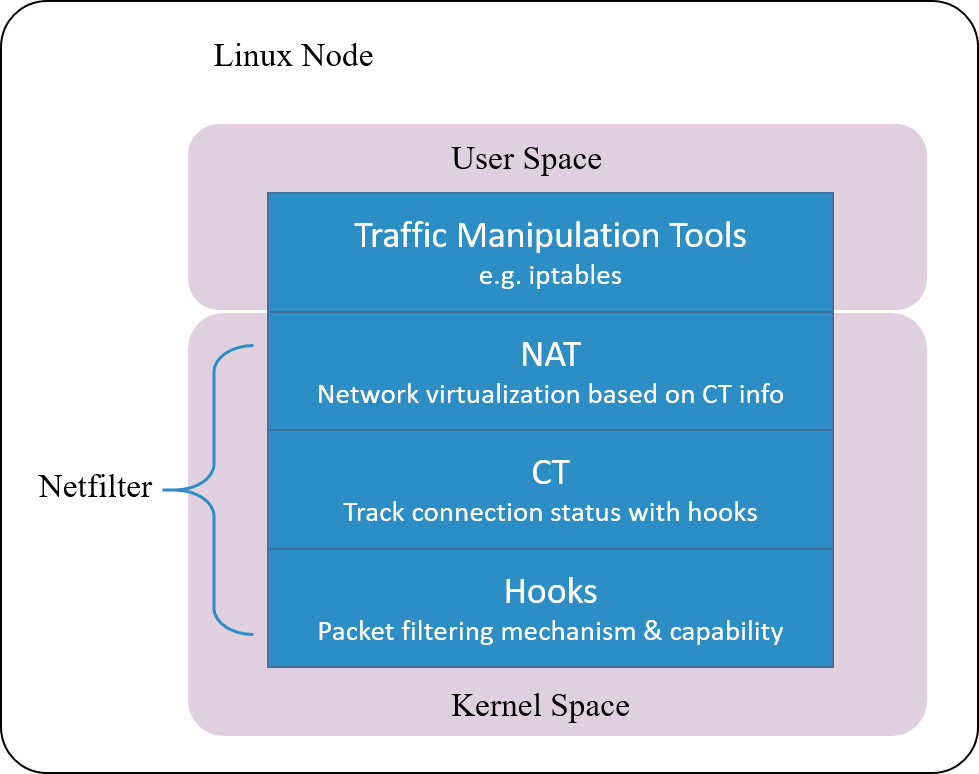

# Design: Netfilter

Connction tracking in Linux kernel is implemented as a module in Netfilter framework.  

Netfilter is a packet manipulating and filtering framework inside the kernel. It provides several hooking points inside the kernel, so packet hooking, filtering and many other processings could be done.

> Put it more clearly, hooking is a mechanism that places several checking points in the travesal path of packets. When a packet arrives a hooking > point, it first gets checked, and the checking result could be one of:
>
> 1. let it go: no modifications to the packet, push it back to the original travesal path and let it go
> 2. modify it: e.g. replace network address (NAT), then push back to the original travesal path and let it go
> 3. drop it: e.g. by firewall rules configured at this checking (hooking) point  

> **Note that conntrack module only extracts connection information and maintains its database, it does not modify or drop a packet. Modification and dropping are done by other modules, e.g. NAT.**

Netfilter is one of the earliest networking frameworks inside Linux kernel, it initially got developed in 1998, and merged into 2.4.x kernel mainline in 2000.

After more than 20 years’ evolvement, it gets so complicated that results to degraded performance in certain scenarios, we will talk a little more about this later.
