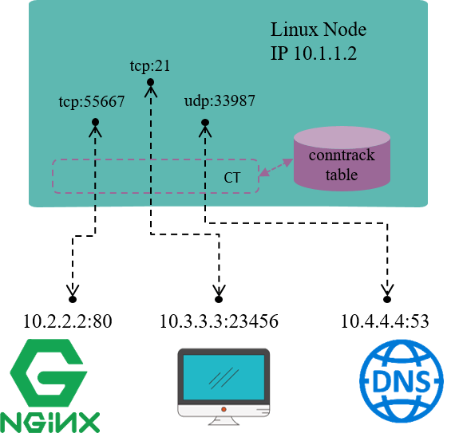

# Concept of ConnTrack

As the name illustrates itself, connection tracking tracks (and maintains) connections and their states.
  

For example, in Fig 1.1, the Linux node has an IP address 10.1.1.2, we could see 3 connections on this node:

- 10.1.1.2:55667 <-> 10.2.2.2.:80: locally originated connection for accessing external HTTP/TCP service  
- 10.3.3.3:23456 <-> 10.3.3.2.:21: externally originated connection for accessing FTP/TCP service in this node  
- 10.1.1.2:33987 <-> 10.4.4.4.:53: locally originated connection for accessing external DNS/UDP service   

Conntrack module is responsible for discovering and recording these connections and their statuses, including:

Extract tuple from packets, distinguish flow and the related connection.  
Maintain a “database” (conntrack table) for all connections, deposit information such as connection’s created time, packets sent, bytes sent, etc.  
Garbage collecting (GC) stale connection info  
Serve for upper layer functionalities, e.g. NAT   

But note that, the term “connection” in “connection tracking” is different from the “connection” concept that we usually mean in TCP/IP stack. Put it simply,  

- In TCP/IP stack, “connection” is a layer 4 (transport layer) concept.  
  - TCP is a connection-oriented protocol, all packets need to be acknowledged (ACK), and there is retransmission mechanism.
  - UDP is a connectionless protocol, acknowledgement (ACK) is not required, no retransmission either.
- In connection tracking, a tuple uniquely defines a flow, and a flow represents a connection.
  - We will see later that UDP, or even ICMP (layer 3 protocol) have connection entries.
  - But not all protocols will be connection tracked. 

When refering to the term “connection”, we mean the latter one in most cases, namely, the “connection” in “connection tracking” context.
